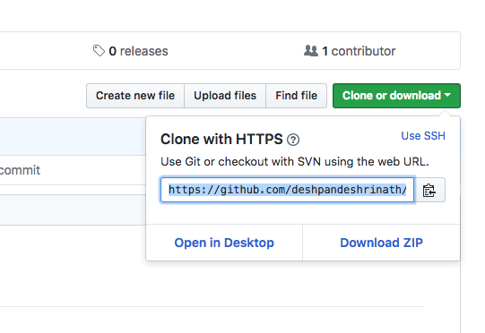

# bibtex-lib
A repository to manage .bibtex References

## Instruction for Windows User
Download GitHub Desktop app from [https://desktop.github.com/](https://desktop.github.com/)
Click on the Open In Desktop button as shown in 
Follow the instruction on how to pull and push

## Instruction for Mac/Linux User
Setup repo from terminal

``` bash
git clone https://github.com/deshpandeshrinath/bibtex-lib.git
```
