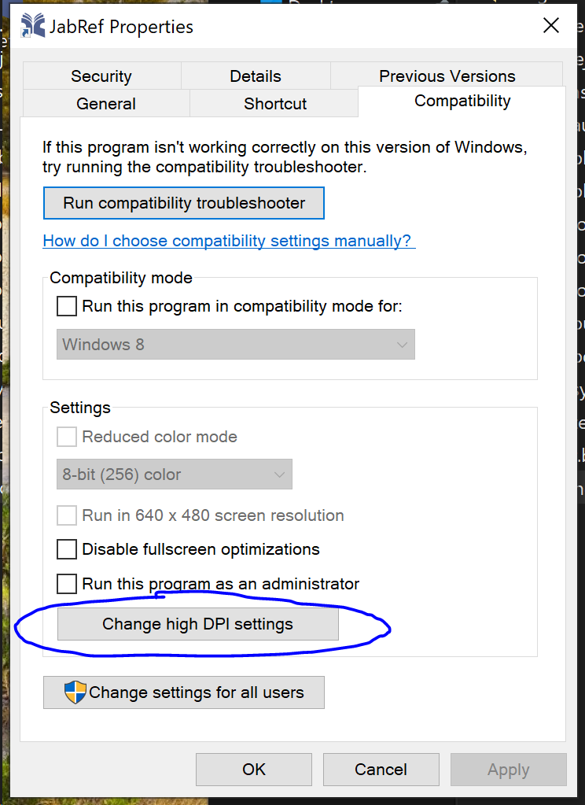
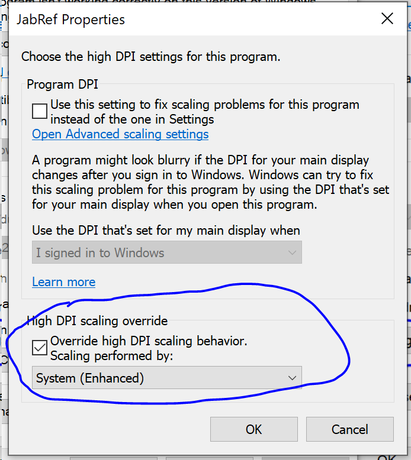

# bibtex-lib
A repository to manage .bibtex References

## Instruction for Windows User
1. Download GitHub Desktop app from [https://desktop.github.com/](https://desktop.github.com/)
2. Download JabRef from https://www.jabref.org/ JabRef is an open source bibliography reference manager. The native file format used by JabRef is BibTeX, the standard LaTeX bibliography format. JabRef works well on Linux and Mac OSX as well.

### Instructions for JabRef user
Use JabRef to manage (create/copy/edit/delete) references. This would be saved in a .bibtex file. Use Github to pull and push references.

### Instructions for GitHub Desktop user
Click on the Open In Desktop button as shown in 


Follow the instruction on how to pull and push; see this webpage for how to do that https://docs.github.com/en/desktop/contributing-and-collaborating-using-github-desktop/pushing-changes-to-github

## Instruction for Mac/Linux User
Setup repo from terminal

``` bash
git clone https://github.com/deshpandeshrinath/bibtex-lib.git
```

## JabRef on Windows Troubleshooting

For everyone using JabRef on windows, you could get a weird GUI scaling problem. Everything could appear tiny and barely visible. To fix it go into its properties by right-clicking the icon and select "Change high DPI settings".

Next, in the pop-up dialog box, select "System" under High DPI scaling overide option. This should fix the problem.

